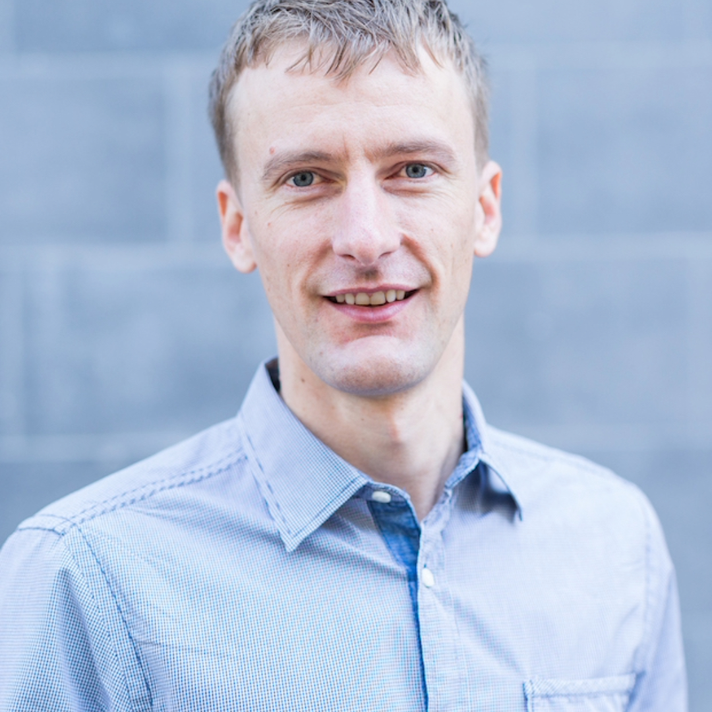
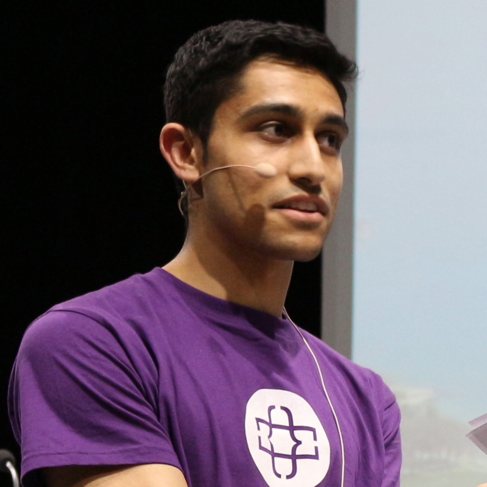

# Mini-hackathon on LLMs and GenAI APIs

Come join us for a fun and innovative hackathon exploring APIs and LLM architecture modifications! Let's build exciting projects together 🎉

[1. General Information](#1-general-information)  
[2. Themes](#2-themes)  
[3. Resources](#3-resources)  
[4. Schedule](#4-schedule)  
[5. Team Formation](#5-team-formation)  
[6. Submission Process](#6-submission-process)  
[7. Communication (Discord)](#7-communication-discord)  
[8. Evaluation Criteria](#8-evaluation-criteria)  
[9. Jury](#9-jury)  
[10. Acknowledgements](#10-acknowledgements)

## 1. General Information

### **Date & Time:**
  - **Date:** Friday, April 19 to Saturday, April 20
  - **Time:** 6:00 PM (Apr 19) to 5:00 PM (Apr 20)

### **Location:**
  - [BC Building, 4th floor](https://www.google.com/maps/place/BC+Building+(building+of+the+IC+faculty)/@46.5188791,6.5627602,18z/data=!4m6!3m5!1s0x478c30fcd9c6f5b3:0xd37877e203e479a8!8m2!3d46.518569!4d6.561918!16s%2Fg%2F1pv1l1jcp?entry=ttu) (IC Faculty Building)  
  - Chem. Alan Turing, 1015 Ecublens, Switzerland  

## 2. Themes

[LauzHack](https://lauzhack.com/) is hosting a mini-hackathon with two exciting tracks:

1. **GenAI Applications:**
  - The use of GenAI APIs and models (OpenAI, Langchain, HuggingFace, etc).
  - The Telegram bot builder API can be optionally used for a quick-and-dirty user interface.
  - Build innovative products like an interactive academic publication bot or combine APIs for new applications!

2. **LLM Architecture Modifications:**
  - Identify practical tricks to enhance efficiency and accuracy of LLMs (Large Language Models) on a given dataset.
 
## 3. Resources

1. **GenAI Applications:**
- [Tutorial](https://github.com/LauzHack/apis-telegram) on making a Telegram bot with GenAI APIs. **This will be done on Friday!**
- Message `Eric (organizer)` on the LauzHack Discord for an OpenAI key!

2. **LLM Architecture Modifications:**
- [LLM baselines](https://github.com/epfml/llm-baselines) which **will be presented on Friday**. 
- Getting started with EPFL clusters: https://github.com/epfml/getting-started-lauzhack/
- Access to compute from Prof. Martin Jaggi's lab provided on-site.

Below are links to complementary resources/tutorials which will NOT be covered during the hackathon:
- [Gradio](https://www.gradio.app/) for hosting a demo.
- Example interactive web app with HTML and OpenAI: https://github.com/bitswired/python-web-dev-with-htmx 
- Serverless endpoints with [together.ai](https://docs.together.ai/docs/inference-python)
- RAG with LangChain slides/Colab notebooks ([Part 1](https://docs.google.com/presentation/d/1nR8klAPeRB6LRJPLk2XQZ951cg7wYuh0uWxgpPg_J7U/edit#slide=id.g2adef65e407_0_396), [Part 2](https://docs.google.com/presentation/d/1ud51c1bGjXJGXAmOypQCKdZtu_aAoeHdYYGiaESPfdA/edit#slide=id.g2adef65e407_0_396)).
- (Login required) Short course on using Hugging Face models and Gradio: https://www.deeplearning.ai/short-courses/open-source-models-hugging-face/
- (Login required) More short courses from DeepLearning.ai (LangChain, RAG, Vector Databases, etc): https://learn.deeplearning.ai/
- Google Colab for GPU compute: https://colab.research.google.com/

## 4. Schedule

**Friday, April 19:**
  - 6:00 PM: Tutorials/Workshops (BC420)
    - Intro to the event
    - Tutorial on making a Telegram bot with GenAI APIs
    - Pizza
    - (Around 8) Tutorial on training LLM baseline
    - Spontaneous tutorials based on people's interests.
  - 10:00 PM: End of day. You CANNOT stay overnight, but you can continue working remotely.
  
**Saturday, April 20 (only for partipants whose application was approved):** 
  - 10:00 AM: Breakfast (BC410)
  - Till 3:00 PM: Hack, hack, hack!
  - 3:30 PM: Demos (for everyone) then prizes 🏆 (for application track)

**Aftermath:** 
  - Sunday April 21, midnight: submission deadline for track 2 (training LLMs)
  - Tuesday April 23, 4pm: announcement of winners of track 2

😋 We will provide dinner on Friday and (breakfast, lunch) on Saturday.

## 5. Team Formation

Up to 4 members per team. Declare your team [here](https://docs.google.com/spreadsheets/d/1-kltAtBRmXvM_HjfXcLKk_qDzaVmV03A6PDqzfMWOaM/edit?usp=sharing).

## 6. Submission Process

All projects should be submitted on DevPost (coming soon).

In order to be considered for a prize, **all projects should demo/present (3 min for API track, and 2 min for LLM track) on Saturday afternoon**.

#### _Particularies for the LLM Architecture Modifications track_

Due to potentially long trainings, submission can be made until **Sunday April 21, 23:59:59**. Teams are still expected to demo/present on Saturday afternoon, but winners for this track will be announced on **Tuesday April 23**.
Resources: 1) [Getting started guide for GPU cluster](https://github.com/epfml/getting-started-lauzhack), 2) [llm-baselines code](https://github.com/epfml/llm-baselines) to start from. Submission consist in a link to your github repo (see criteria below), to be made to Prof. Martin Jaggi's lab via discord. 

## 7. Communication (Discord)

Real-time information about the event, food service details, and questions related to the challenges will be posted in our personal Discord server (`#hack-apr2024` channel). Please use the link sent to you via Luma (as this will add you to the private channel for the event).

## 8. Evaluation Criteria

Only work done during hackathon will be considered (and should be made explicit) for the project evaluation.

### **GenAI Applications** 

| Criteria                                           | Allocated points |
|------------------------------------------------------|------------------|
| **1. Technical Impressiveness**                                       | **6**               |
| &nbsp;&nbsp; 1.1. How impressive is the project from a technical perspective? | 3               |
| &nbsp;&nbsp; 1.2. How reasonable the technical and programming solutions are, given the limited timeframe of a hackathon?        | 3                |
| **2. Idea**                                        | **6**                |
| &nbsp;&nbsp; 2.1. How innovative, original and unexpected the project is? | 3               |
| &nbsp;&nbsp; 2.2. How usable the idea is for the real-world target population to which the project is aimed?hackathon?        | 3                |
| **3. Prototype**                               | **8**                |
| &nbsp;&nbsp; 3.1. Does the prototype work as advertised by the team, and as expected from a one-day work?| 4              |
| &nbsp;&nbsp; 3.2. Does the prototype provide a good user experience and usability? | 4                |
| **4. Presentation**                               | **4**                |
| **5. Integrity Check**                               |                 |
| **TOTAL**                                            | **24**           |

A detailed judging criteria can be found at the following [link](https://docs.google.com/document/d/1VW-y-2CozKQh-x35cimA2p04m-XExTSxgelhDTolVwk/edit).

### **LLM Training and Architectures Track** 

| Criteria                                           | Allocated points |
|------------------------------------------------------|------------------|
| **1. Performance reached in 3h on 1 GPU**             | 20               |
| **2. Innovativeness of the approach**                 | 10                |
| **TOTAL**                                            | **30**           |

Final submission deadline: Sunday midnight.
Submitting the link to your github repository. The ReadMe of your repo needs:
	1) a short description of your idea and approach
	2) a link to the final model weights of your trained model
	3) the training script and config so we can reproduce your training (must be easy to run on EPFL cluster)
we will verify submissions and run to check reproducibility

## 9. Jury

<table>
  <tbody>
    <tr>
      <td align="center" valign="top" width="20%">
        <a href="https://www.linkedin.com/in/martinjaggi?originalSubdomain=ch">
          
           <b>Prof. Martin Jaggi</b>
        </a>
      </td>
      <td align="center" valign="top" width="20%">
        <a href="https://linkedin.com/in/eric-bezzam?originalSubdomain=ch">
          
           <b>Eric Bezzam</b>
        </a>
      </td>
      <td align="center" valign="top" width="20%">
        <a href="https://www.linkedin.com/in/luca-fusar-bassini-46522a1bb/?locale=en_US">
          
           <b>Luca Fusar Bassini</b>
        </a>
      </td>
      <td align="center" valign="top" width="20%">
        <a href="https://www.linkedin.com/in/spneshaei/?originalSubdomain=ir">
          
           <b>Seyed Parsa Neshaei</b>
        </a>
      </td>
    </tr>
  </tbody>
</table>

## 10. Acknowledgements

A BIG thanks to the [MLO lab at EPFL](https://www.epfl.ch/labs/mlo/) for technical support and Track #2, and to [Huawei](https://www.huawei.com) for sponsoring 🙏
